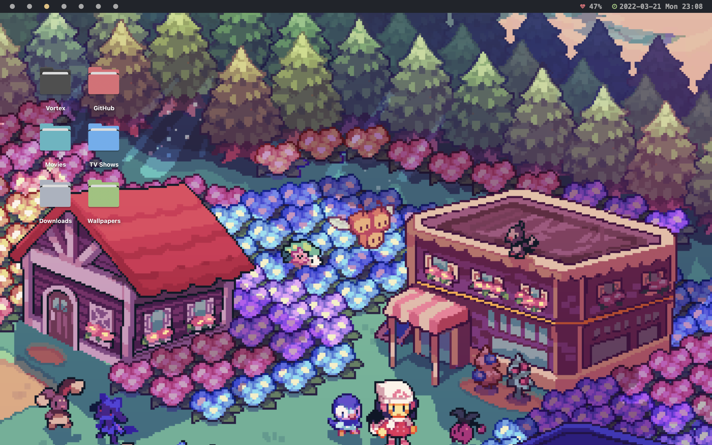
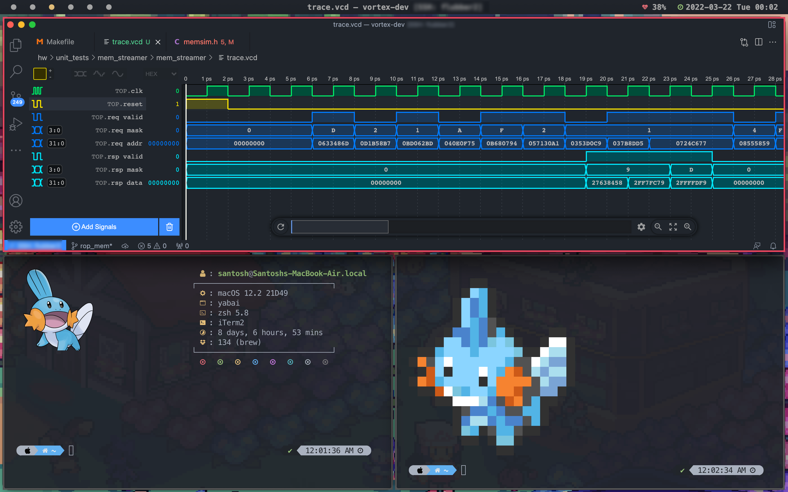
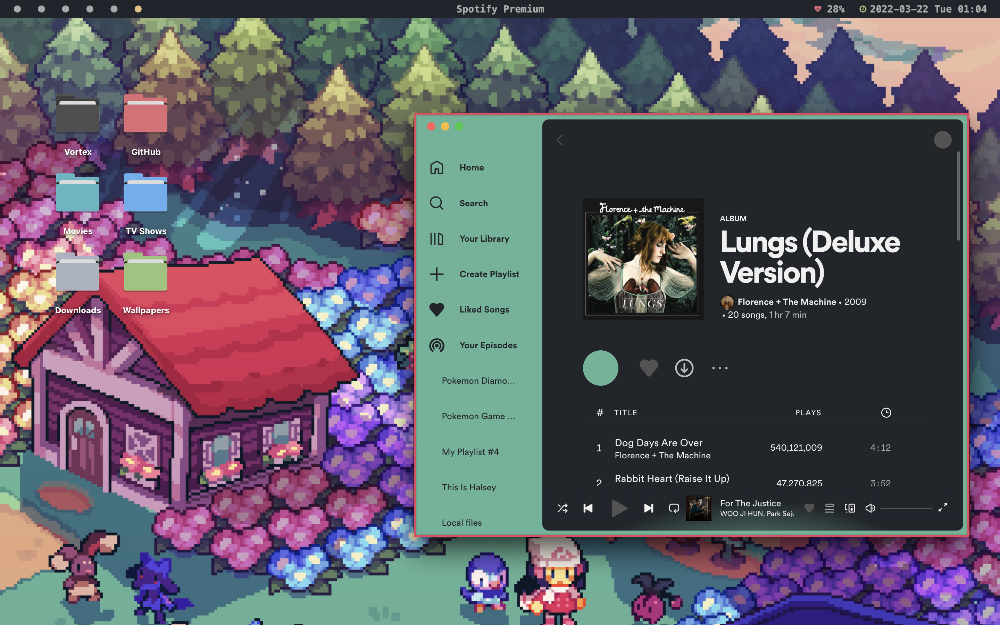

# My Dotfiles!

Welcome! And thanks for dropping by. 

🖥 These are some of the applications I use in my current OSX setup.

1. Window Manager: [yabai](https://github.com/koekeishiya/yabai)
2. Window borders: [yabai v4.0.0](https://github.com/koekeishiya/yabai/blob/master/CHANGELOG.md)
3. Bar: [spacebar](https://github.com/cmacrae/spacebar)
4. Spotify: [spicetify](https://github.com/spicetify/spicetify-cli)
5. Terminal: [iTerm2](https://iterm2.com) (One Dark)
6. Text Editor: Visual Studio Code (One Monokai)
7. Waveform Viewer: [wavetrace](https://www.wavetrace.io)
7. Wallpaper: Floaroma Town by [Kianna Mosser](https://www.inprnt.com/gallery/kianamosser/)
---
📸 Screenshots

